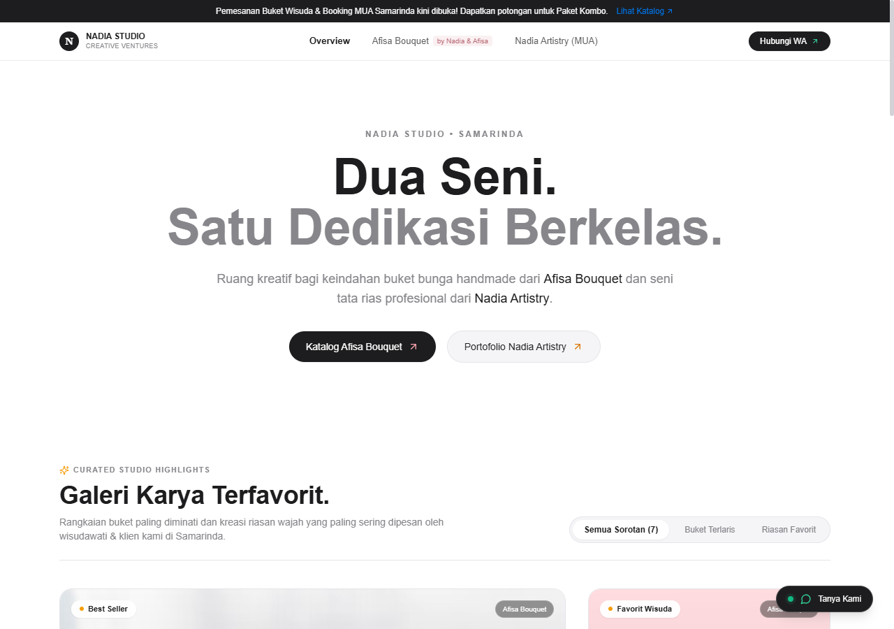
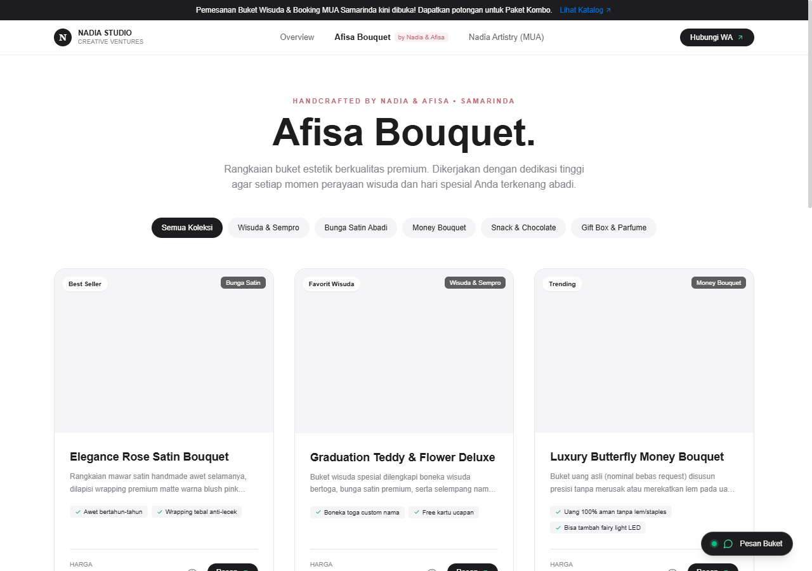
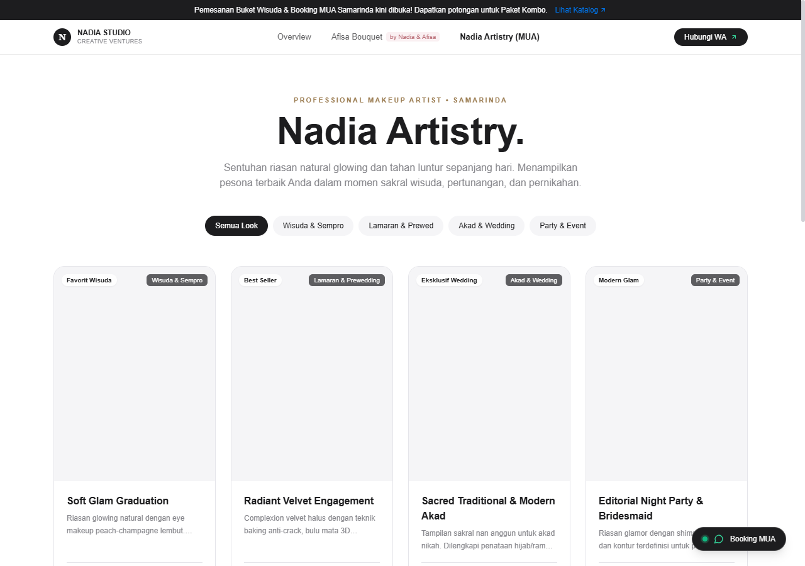
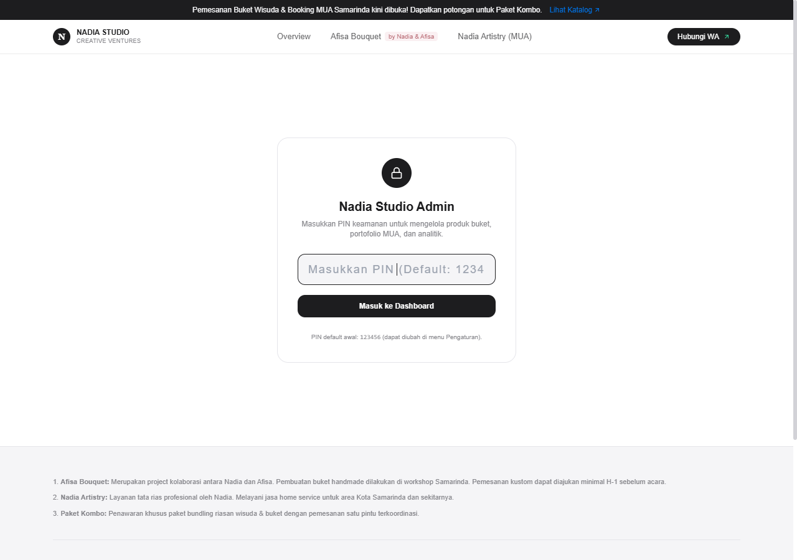

# 📖 Buku Panduan Pemakaian Website: Nadia Studio
*(Afisa Bouquet & Nadia Artistry MUA)*

Panduan ini dibuat secara ringkas dan praktis untuk membantu **Nadia & Afisa** mengoperasikan dan mengelola website sendiri sehari-hari tanpa perlu keahlian koding.

---

## 🌟 1. Alamat Halaman Website (Satu Domain)

Website ini dirancang untuk berjalan di bawah 1 domain (misal: `nadia-business.com`):

| Halaman | Alamat URL | Untuk Siapa? | Keterangan Singkat |
| :--- | :--- | :--- | :--- |
| **Beranda Utama (Hub)** | `/` | Pengunjung Umum | Gerbang utama yang memuat perkenalan studio, **Galeri Karya Terfavorit**, serta info **Paket Kombo Wisuda**. |
| **Katalog Buket** | `/afisabouquet` | Pembeli Buket | Showcase buket wisuda, mawar satin abadi, buket uang, snack, dan hampers parfum. Dilengkapi filter kategori & tombol pesan WA. |
| **Portofolio MUA** | `/makeup-artist` | Klien Makeup | Galeri foto riasan (wisuda, lamaran, wedding, event) dan pricelist paket rias. |
| **Dashboard Pengelola** | `/studio-admin` | **Rahasia Nadia & Afisa** | Pintu masuk khusus pemilik untuk tambah/edit buket, foto rias, ganti nomor WA, dan memantau jumlah klik chat. |

> 🔒 **Catatan Keamanan:** Menu *Admin* sengaja **tidak ditampilkan** di bilah navigasi publik maupun footer agar tidak terlihat oleh pengunjung umum. Hanya Anda yang mengetahui alamat `/studio-admin`.

---

## 📸 2. Cuplikan Tampilan Website

### A. Beranda Utama & Galeri Karya Favorit (`/`)
Tampilan minimalis terinspirasi gaya Apple. Menonjolkan foto produk dengan bersih tanpa elemen norak.


### B. Showcase Afisa Bouquet (`/afisabouquet`)
Pengunjung dapat memfilter buket wisuda, satin, buket uang, hingga hampers. Foto dapat diklik untuk memperbesar detail dan langsung terhubung ke WhatsApp.


### C. Showcase Nadia Artistry (`/makeup-artist`)
Menampilkan portofolio riasan wajah beresolusi tinggi, pricelist paket wisuda/lamaran, hingga penawaran Paket Kombo (Makeup + Buket).


### D. Panel Admin Studio (`/studio-admin`)
Dilindungi PIN keamanan sederhana. Memuat statistik pengunjung, jumlah klik tombol WhatsApp, dan formulir untuk menambah produk baru.


---

## 🛠️ 3. Panduan Praktis Pengelolaan (Dashboard Admin)

### Langkah 1: Cara Masuk ke Halaman Admin
1. Buka browser dan ketik alamat: `alamatwebsite.com/studio-admin`  
   *(Jika dicoba di laptop sendiri: `http://localhost:3000/studio-admin`)*
2. Masukkan PIN Keamanan: **`123456`** *(PIN default)*
3. Klik tombol **Masuk ke Dashboard**.

---

### Langkah 2: Memantau Traffic & Calon Pembeli (Tab "Traffic & Leads")
Di halaman utama dashboard, Anda bisa melihat data penting:
* **Total Kunjungan Web:** Berapa kali website dibuka oleh pengunjung.
* **Klik Pesan WhatsApp:** Berapa calon pelanggan yang menekan tombol *Pesan Buket* atau *Booking MUA*.
* **Tabel Produk Terpopuler:** Buket atau paket rias mana yang paling banyak ditanyakan orang, sehingga Anda tahu varian mana yang perlu diproduksi lebih banyak.

---

### Langkah 3: Menambah atau Mengubah Buket (Tab "Katalog Buket")
1. Klik tab **Katalog Buket**.
2. Untuk menambah baru, klik tombol hitam **+ Tambah Buket**.
3. Isi data:
   * **Nama Buket:** (contoh: *Buket Mawar Satin Baby Pink*)
   * **Kategori:** Pilih *Bunga Satin, Wisuda, Money Bouquet, dll.*
   * **Harga:** (contoh: *Rp 75.000*)
   * **Link Foto:** Masukkan link gambar buket.
   * **Deskripsi Singkat & Keunggulan:** (contoh: *Free kartu ucapan, awet selamanya*).
4. Klik **Simpan Buket**. Produk baru langsung muncul di katalog secara otomatis!
5. Untuk mengubah harga atau menghapus buket lama, cukup klik ikon **Pensil (Edit)** atau **Tempat Sampah (Hapus)** pada kartu buket.

---

### Langkah 4: Menambah Foto Hasil Riasan (Tab "Portofolio MUA")
1. Klik tab **Portofolio MUA**.
2. Klik tombol **+ Tambah Look Riasan**.
3. Masukkan judul look (misal: *Soft Glam Graduation Look Unmul*), pilih kategori acara (*Wisuda / Lamaran / Wedding*), dan masukkan link fotonya.
4. Klik **Simpan Look**. Foto portofolio baru akan langsung menghiasi galeri MUA.

---

### Langkah 5: Mengubah Nomor WhatsApp & Promo (Tab "Pengaturan Bisnis")
1. Klik tab **Pengaturan Bisnis**.
2. Anda bisa mengubah:
   * **Nomor WhatsApp:** Masukkan nomor dengan awalan `62` (contoh: `6282154309113`). Seluruh tombol di website akan otomatis tersambung ke nomor baru ini.
   * **Teks Pengumuman Atas:** Ubah tulisan banner promo (misal: *"Promo Spesial Wisuda: Diskon 10% Paket Kombo"*).
   * **Alamat Workshop:** Ubah alamat workshop jika berpindah lokasi.
   * **PIN Baru:** Ubah PIN 6-digit sesuai keinginan Anda agar lebih aman.
3. Klik **Simpan Perubahan**.

---

## 💻 4. Cara Menjalankan Website di Komputer / Laptop

Jika Anda ingin membuka atau menguji website di laptop:
1. Buka aplikasi **Terminal / Command Prompt / PowerShell**.
2. Masuk ke folder proyek:
   ```bash
   cd "c:\Users\kegz\Desktop\Folder iko\Projects Local\Project Sampingan UMKM\Nadia Studio"
   ```
3. Ketik perintah:
   ```bash
   npm run dev
   ```
4. Buka browser (Chrome / Edge) dan buka: **`http://localhost:3000`**

---

## 🚀 5. Cara Memasang Online ke Domain `nadia-business.com` (Hosting Rp 0)

Karena proyek ini dibangun menggunakan **Next.js**, Anda **tidak perlu menyewa hosting/server bulanan**. Cukup gunakan layanan **Vercel** yang menyediakan hosting gratis:

1. Buat akun gratis di [Vercel.com](https://vercel.com).
2. Unggah/sambungkan folder `Nadia Studio` ke Vercel (bisa via GitHub atau via aplikasi Vercel CLI).
3. Di menu *Settings > Domains* di Vercel, masukkan domain yang Anda beli (misal: `nadia-business.com`).
4. Ikuti instruksi DNS singkat yang diberikan Vercel di panel domain Anda.
5. Selesai! Website langsung aktif secara global dengan keamanan SSL (gembok hijau `https://`) gratis selamanya.

---
*Semoga website ini bermanfaat, laris manis, dan membawa berkah bagi perkembangan usaha Afisa Bouquet & Nadia Artistry! ✨*
